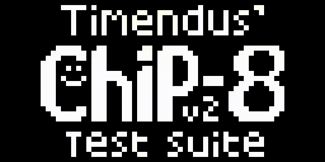
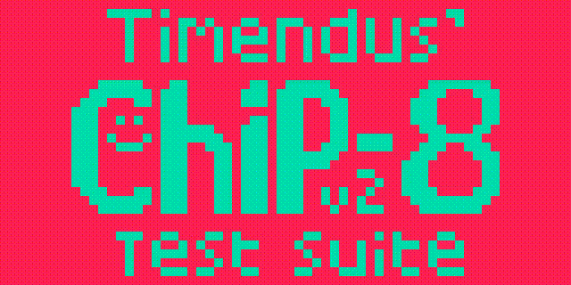
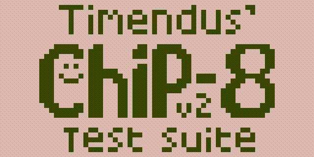
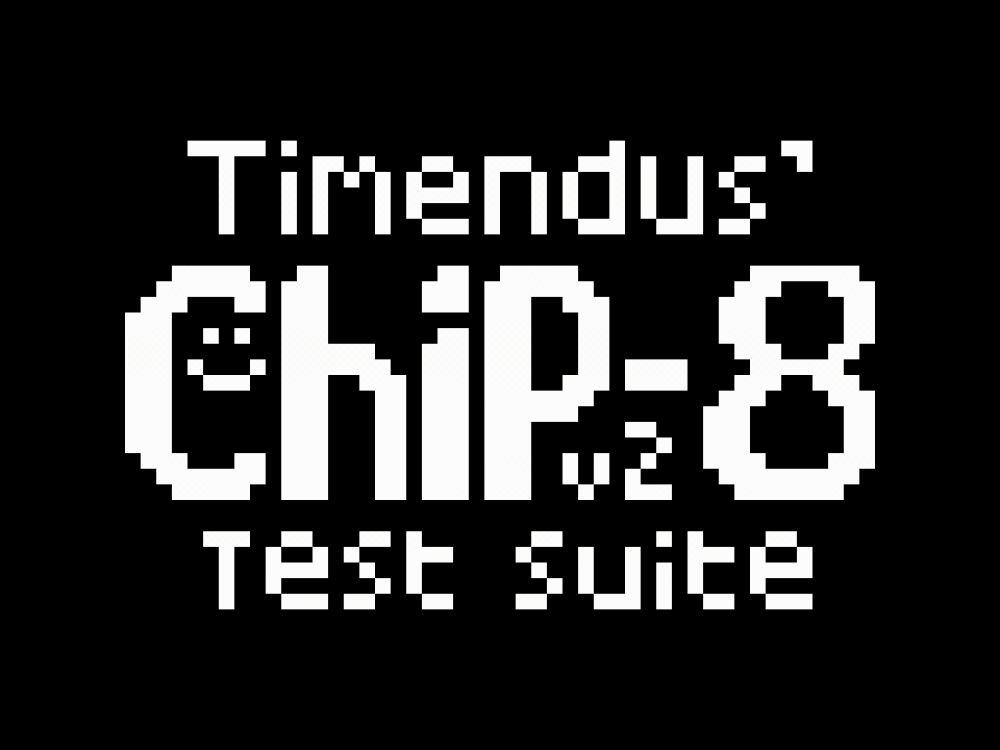

# RC8 - Chip-8 Emulator

A CHIP-8 implemented in Rust.

CHIP-8 is an interpreted language originally used in the [COSMAC VIP](https://en.wikipedia.org/wiki/COSMAC_VIP), and made to make it easier to develop games and similar graphical applications. Technically, there was never a "hardware" implementation of CHIP-8, but since it was defined as a virtual machine (with registers, addresses, interrupts, etc), CHIP-8 "interpreters" are commonly refered as "emulators".

It is commonly used as the "hello world" for emulator enthusiasts. If you're curious, take a look at the [technical reference](https://github.com/mattmikolay/chip-8/wiki/CHIP%E2%80%908-Technical-Reference) to learn more.

## Features / Roadmap

- [X] All [instructions](https://github.com/mattmikolay/chip-8/wiki/CHIP%E2%80%908-Instruction-Set) implemented with test cases.
- [X] Proper, "clipped" drawing.
- [X] 100% pass on the [CHIP-8 test suite](https://github.com/Timendus/chip8-test-suite).
- [X] Sound (buzzer) support.
- [X] Option to set background/foreground.
- [X] Option to change the display size.
- [X] Pause/continue.

**Note that this aims to emulate the "normal" CHIP-8, and *NOT* its multiple variants, like S-CHIP8, CHIP-8C, M-CHIP8, etc.** If you encounter "odd" behavir, please double-check if you're using a correct ROM file.

## Building and running

Before building, make sure you have SDL2 headers available on your system. On most Linux distributions this is included on the `sdl2`, `sdl2-dev`or similarly-named package. You will also need to [install Rust](https://www.rust-lang.org/tools/install).

Once everything is installed, just run `cargo`:

```sh
$ cargo build --release

# This will download all dependencies and compile a 'rc8' release binary.
# You can get it at target/release folder
```

To run with the default options, just provide the ROM name:

```sh
# Run the binary directly
target/release/rc8 some-rom-file.ch8

# If you want, you can run directly on cargo too
$ cargo run -- some-rom-file.ch8
```

To exit the emulator, type `Esc`. See [Keyboard mapping](#keyboard-mapping) for details.

## Command-line options

Use `--help` to show the available command-line options:

```bash
rc8 0.1.0
Rafael Ibraim <ibraim.gm@gmail.com>
A simple Chip8 emulator

USAGE:
    rc8 [OPTIONS] <FILENAME>

ARGS:
    <FILENAME>    ROM file to load

OPTIONS:
        --bg <BG>                      Set the background color
    -f, --fullscreen                   Enable fullscreen
        --fg <FG>                      Set the foreground color
    -h, --help                         Print help information
    -V, --version                      Print version information
    -w, --window-size <WINDOW_SIZE>    Size of the window (WxH)
```

If no options are specified, you get a 640x320 black and white output:



You can change the colors to a specific hex value by using `--fg` and/or `--bg`. If only one one the values is specified, the system will pick the opposite value automatically.

For example, this was ran with `--fg #00dead`:



And this with `--bg #cabeca`:



You can also use `-w`/`--window-size` to change the window size, or just `-f` to make it full screen. In both cases, the aspect ratio is preserved and you will see black bars on the screen to account for the diferent ratio.



## Keyboard mapping

```text
 (Your keyboard)                     (CHIP-8 Keyboard)
,---,---,---,---,                    ,---,---,---,---,
| 1 | 2 | 3 | 4 |                    | 1 | 2 | 3 | C |
,---,---,---,---,                    ,---,---,---,---,
| Q | W | E | R |                    | 4 | 5 | 6 | D |
,---,---,---,---,      >>>>>>>>      ,---,---,---,---,
| A | S | D | F |                    | 7 | 8 | 9 | E |
,---,---,---,---,                    ,---,---,---,---,
| Z | X | C | V |                    | A | 0 | B | F |
'---'---'---'---'                    '---'---'---'---'

  ,-------------,
  |   Spacebar  |      >>>>>>>>      Pause/Resume
  '-------------'
          ,-----,
          | Esc |      >>>>>>>>      Quit
          '-----'
```

## License

For details, please see `LICENSE`.

This project uses extra resources made by different people:

- [Computer Speak v0.3](https://fontlibrary.org/en/font/computer-speak) font, by Mcguy215.
- [CHIP-8 Test suite](https://github.com/Timendus/chip8-test-suite) rom, by [Timendus](https://github.com/Timendus).
- [CHIP-8 Test ROM with audio](https://github.com/NinjaWeedle/chip8-test-rom-with-audio), from [NinjaWeedle](https://github.com/NinjaWeedle).
- Additional roms for testing from [this repository](https://github.com/kripod/chip8-roms).
